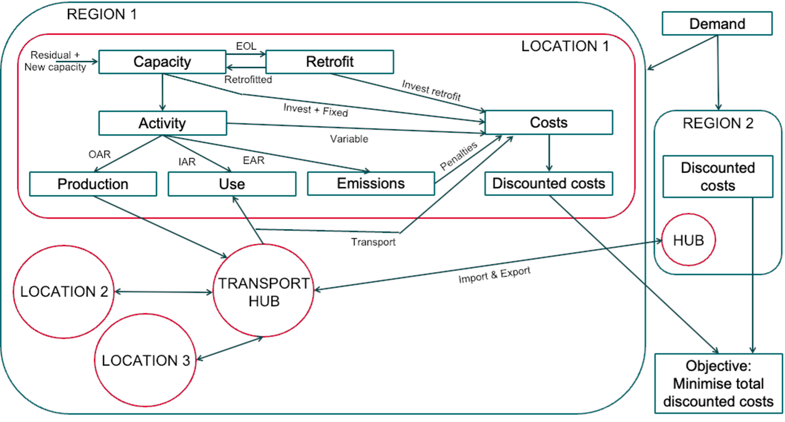

********
Concept
********

ITOM is a framework providing the necessary elements for building capacity-expansion and 
supra yearly dispatch optimisation models of basic industry sectors. Models built with ITOM 
minimize the total discounted costs of the system overthe modelling time horizon.

The framework is designed to be flexible and modular, 
allowing users to adapt it to their specific needs and research questions. 
It is built on the principles of open-source software, enabling transparency and 
collaboration in the development of industry system models. This approach mirrors that of a number 
of existing open source *energy system* models, including the OSeMOSYS project (Open Source Energy Modeling System) [#f1]_
from which we borrowed a number of design ideas and their code implementation.

The framework is built as a succession of equations constituting the constraints of the linear programming
(LP) problem. These equations model various aspects of a basic industry sector, such as investment
in production capacities, asset utilisation, transport of commodities and products, etc. Exogenous
parameters such as final demand, costs, production yields, emission intensities etc. are required to calibrate 
the model for a given scenario. A strength of the framework is that it allows for a high geographical resolution,
down to the level of production sites or single plants. The production network resulting from the potential 
exchange of products between producing sites is optimised endogenously, providing insight into a sector's supply chain. 
The Figure below presents a simplified view of this model design. Details are provided in the following chapters.

   Schematic concept of ITOM's building blocks and their interactions to form a model for a basic industry sector

The ITOM framework is programmed in python. It can use either the `Pyomo library`_ or our own `tinyomo`_ clone to build
the LP problem and serve it to a solver. It is user friendly in that data input
can occur through one Excel file (one sheet per parameter) or a number of csv files (one file per
parameter).
Finally, the granularity of the model, that is how many commodities, technologies, sites, etc. are
considered is at the user’s discretion. The only really limiting factors regarding the level of detail that
can be modelled is data availability and the size of the resulting LP problem.

.. _Pyomo library: https://www.pyomo.org/
.. _tinyomo: https://github.com/wupperinst/tinyomo/tree/main

.. rubric:: Footnotes

.. [#f1] Howells, M., Rogner, H., Strachan, N., Heaps, C., Huntington, H., Kypreos, S., Hughes, A., 
   Silveira, S., DeCarolis, J., Bazillian, M., Roehrl, A. (2011) OSeMOSYS: 
   The Open Source Energy Modeling System - An introduction to its ethos, structure and development. 
   *Energy Policy*, 39 (2011), 5850–5870.
