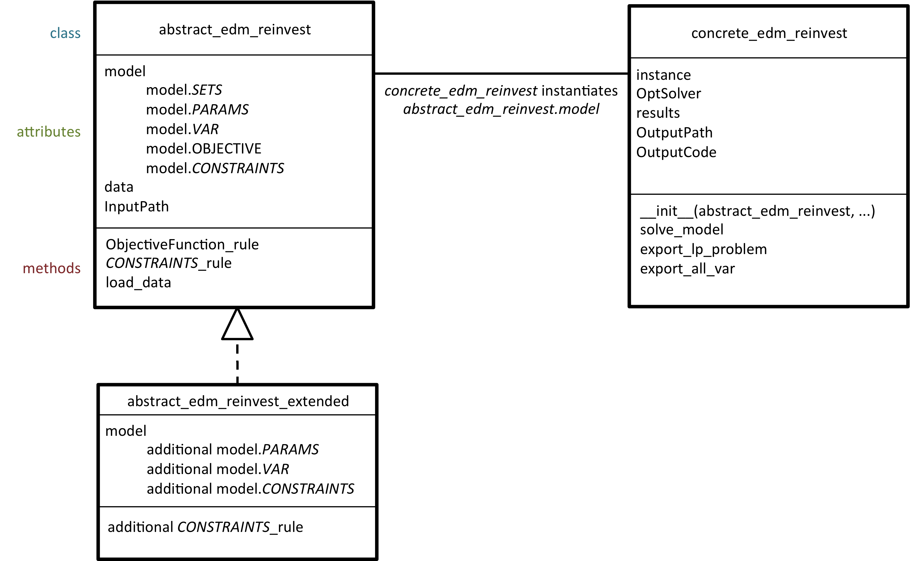

******
Design
******

Directory structure
====================

The WI EDM ReInvest model resides in the directory */reinvest* in the repository *energy_demand_model*.
The directory structure of the model is as follows:

- *root:* contains the configuration file *config.yaml* which is used to set up model runs.
- *doc:* contains the *source* files of the code documentation and the built documentation (in directory *build*).
- *input:* contains in separate directories the *.csv* input files required for separately defined model runs.
- *log:* contains in separate directories the ouput of Pyomo's debugging utilities when the optimisation is infeasible.
- *notebooks:* contains in separate directories the jupyter notebooks analysing modelling results generated in separately defined model runs.
- *output:* contains in separate directories the *.csv* output files generated in separately defined model runs.
- *scripts:* contains the actual code powering the model.

For more information on how to build documentation (like this one), see the page *Workflow/Documentation* on the repo's wiki.

Scripts
========

The *scripts* directory has the following structure:

- *root:* contains the code implementing the ReInvest model (*edm_reinvest.py*, see next section) and a script controlling model execution (*main.py*, see section :ref:`ref-running-model`)
- *helpers:* contains utility scripts that are either called from *main.py* or that can be used independently (e.g. to bulk-save the sheets of an Excel file to *.csv* files).

Model classes
==============

The following inheritance diagram presents the class components of the WI EDM ReInvest model as implemented in the *edm_reinvest.py* file.
Detailed documentation of the classes, their attributes and methods is available in the :ref:`components` chapter.

The classes *abstract_edm_reinvest* and *concrete_edm_reinvest* build up the **core model**.

The class *abstract_edm_reinvest_extended* is not implemented. The graph just shows how the core model could be 
extended (*via* subclassing) with new sets, parameters, variables, constraints, or even objectives.

   
   Class diagram for WI EDM ReInvest

.. _ref-running-model:

Running the model
==================

With the code design presented in the previous sections, running the EDM ReInvest model consists of the following steps:

1. Edit the *config.yaml* file at the root of the repo.
2. Gather required input data (see section :ref:`ref-input`) as *.csv* files in the directory */input/model_run_code* (where *model_run_code* is the code you gave in the config file).
3. Run the script *main.py* (from the command line or your IDE) in the *scripts* directory.
4. Results will be saved as *.csv* files in the directory */output/model_run_code* and you can analyse those using e.g. a jupyter notebook that you place in the directory */notebooks/model_run_code*.
