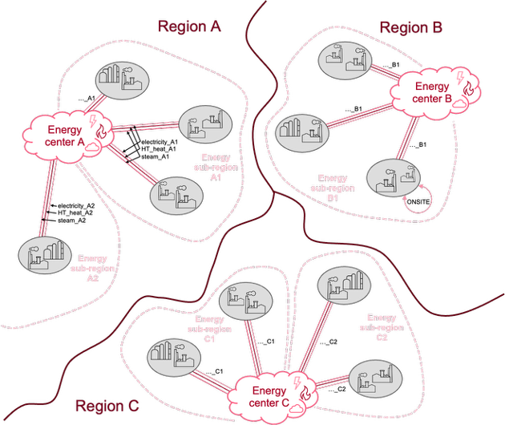

*********************
Implementation hacks
*********************

By design anything can be modelled with the ITOM framework as a *TECHNOLOGY* either transforming or transporting *PRODUCTS*.
Those technologies are characterised with costs, yields and emissions while constraints can be imposed on the investments, 
activities and capacities of the technologies. The rest of this documentation describes how the framework's parameters, variables, and 
equations are intended to use *TECHNOLOGIES* and *PRODUCTS* (and other sets such as *REGIONS* and *LOCATIONS*) to model the "real" world. 
There are of course inherent limitations in what the framework can do as a result of its design.

Here are some examples:

* How to model the effects of sub-regional energy prices, when prices for technologies are expected on a larger, regional level? 
  (i.e. the input parameter *VariableCost* is indexed by *REGION* but not by *LOCATION*)
* How to observe the benefits (if any) of CCS technology, when it does not produce any actual products that are useful for other production processes?
  (CCS stand for Carbon Sequestration and Storage, it only uses CO\ :sub:`2` as input, does not have a *PRODUCT* output)
* How To measure the value of intermediate products, for which there are no exogenous assumption on the level of demand?
  (because of the equations' structure, shadow prices are computed for final products only, i.e. those in the *Demand* input parameter)

Most such limitations can be overcome by extending the framework, i.e. adding new parameters, variables, and equations 
in a subclass of the core model class. In the first example above, it would be relatively trivial to index the *VariableCost* 
parameter by *LOCATION* instead of only by *REGION* to allow for a sub-regional resolution of energy producing technologies, 
and hence modelling sub-regional energy prices. However, this would require entering costs for each technology in each location, 
even if the costs are the same across locations of a given region, which is usually the case. It would increase the workload for 
entering and managing input data as well as the number of equation in the LP problem.

Another way to get the model to answer questions like those listed above, or simply for the model to work as intended, it is sometimes necessary 
to make certain implementations that are less intuitive, do not necessarily correspond to actual real-world structures 
(such as real-world processes, products, and capacities), or otherwise stretch the definition or what a *TECHNOLOGY* or a *PRODUCT* is.
This section explains and summarizes some of the most central “hacks” that can be used to get around such issues.

Restricting invest and use via high costs
============================================

Direct limitations on how much the model is allowed to invest in or use a *TECHNOLOGY* can be set for instance via the parameters 
*LocalTotalAnnualMaxCapacityInvestment* and *TotalTechnologyAnnualActivityUpperLimit*. 
However, those parameters are not sufficient in many cases. They are indexed only at the *TECHNOLOGY* level and not *MODE-OF-OPERATION* level, 
for instance. Or, more typically, they are not desirable: such hard limits can make the model unsolvable 
and the cause can be difficult to find, and it can be difficult to maintain an overview the more parameters are involved. 
Therefore, restrictions can instead often be made via cost parameters (typically *CapitalCost* or *VariableCost*). For instance:

* Technology A is still at a pilot-level, and is expected to be available only from 2040 🡪 *CapitalCost* is set to e.g. 1000000 for 2020-2035.
* Product X is a toxic gas, and cannot be transported between sites 🡪 *VariableCost* for the transport_hub technology for Product X is set as 1000000.

In most cases, such high costs are sufficient for the model to avoid the unwanted behaviour. 
If they are used despite these high costs, i.e. Technology A is invested in 2020 or Product X is transported, 
it signals a problem which can be identified through the extreme costs.

.. note::

   | Be extremely careful with this type of "hacks".
   | It is desirable to keep the range of the matrix coefficients and right-hand side values of the LP problem as small as possible. 10\ :sup:`4` is usually considered best-practice and anything above 10\ :sup:`6` is problematic.
   | Too high ranges in the coefficients and RHS values can (and probably will) lead to numerical issues, especially so with large LP problems.

.. _hacks-pipeline-transfert:

Pipeline transport passing through locations (pipeline_transfert technologies)
===============================================================================

A product can only be transported to a location if there is a technology there that can use the product. 
But what if a product (e.g., ethylene) is produced in Location A, and should be used in Location C but 
must be transported via pipeline from Location A, via Location B, to Location C? In the model structure, 
this transport does not happen by itself, since there is no technology in B that uses the ethylene 
(it should just be transported onwards to C), and therefore it cannot be imported. 

To make this work, we use dummy-technologies named *pipeline_transfert_[PRODUCT]*.  
which have no cost and have the same input as output. For instance, a pipeline_transfert_ethylene can then be placed in Location B, 
allowing ethylene to be transported into B, where it is “used” by this dummy technology, and the “produced” ethylene can be transported 
onwards to Location C.

.. _hacks-energy-centers:

Local energy prices
====================

Energy prices can vary considerably in different countries, therefore possibly also within the regions specified in the model
if these regions encompass several countries. Consider for example a region such as “West” which would include the Netherlands, 
Belgium, and the UK. The chemical cluster Amsterdam-Rotterdam-Antwerp (ARA) and UK, both belonging to the model region “West”, 
however UK has electricity prices almost double that of ARA.

Energy products (e.g. electricity, heat, and steam), 
are produced in the model via the respective technologies (e.g. electricity_production, HT_heat_production and steam_production). 
The parameters *InputActivityRatio*, *OutputActivityRatio*, and *VariableCost* that could be used to differentiate these technologies'
inputs, outputs, and costs have a regional resolution by definition. 

Without modifying the parameters' definitions and all related equations, we need a non-trivial approach to capture sub-regional energy prices.
In essence, our solution consists of energy production in dummy-locations called *ENERGY_CENTER_[REGION]*, 
and energy transport to the actual locations via “pipeline” transport. The price of the energy product, e.g., electricity, 
in e.g. ARA-locations, is in practice set not through the (perhaps more intuitive) VariableCost of “electricity_production”, 
but through the “pipeline” transport cost to a specific location. Below is a graphical representation of how the modelled system is set up.

   
   Modelling sub-regional energy prices in ITOM

To implement this in practice, the model input is designed in the following ways:

* Each location has beforehand been assigned an energy sub-region, based on the country.
* Energy center dummy-locations are given LocalResidualCapacity for the energy production technologies.
* New investments in energy production technologies are restricted (via high CapitalCost), so that it cannot be built in any actual production sites.
* The energy production technologies produce 1 unit of the respective energy product, at a VariableCost of 1 €/GJ (not 0, in order to prevent any non-used production)
* The energy center of a region has “energy pipelines” to each of the locations in that region, defined via:

    * *TRANSPORTMODE* (named as *[energy product]_[sub-region]*),
    * *TransportRoute_pipeline* (for each of the TRANSPORTMODEs and respective products, from the energy center of the region, to each of its locations), 
    * *TransportCapacity_pipeline* (unlimited), 
    * *TransportCapacityToActivity*, and 
    * *TransportCostByMode* (equal to the desired energy price in that sub-region, minus 1 due to the VariableCost of 1)

The model input data for this "hack" can be generated automatically in a data-preparation step, 
after mapping each location to its energy sub-region and entering energy prices for each sub-region.

Fossil input, process emissions, CCS, and CO\ :sub:`2` price
=============================================================

This "hack" is implemented in the petrochemical sectoral model (see :ref:`itom-petchem`) to track and put a price on both the fossil raw material input 
and the process CO\ :sub:`2` emissions.

**Process emissions** arise from a range of processes, and are tracked as different CO\ :sub:`2` 
products in the model. The CO\ :sub:`2` products include flue\_gas\_\ CO\ :sub:`2`, unavoidable\_\ CO\ :sub:`2`, and uncompressed\_\ CO\ :sub:`2` or 
and syngas\_\ CO\ :sub:`2` (depending on the composition and potential use as syngas component). 
These emissions can be captured and stored by the respective CCS technologies. However, to be able to price these emissions 
(and reversely incentivize capture and storage) in the model, additional processes and products have been implemented as follows:

* A dummy-technology called *EU_ETS* produces CO\ :sub:`2`\_allowance products at a *VariableCost* that represents the CO\ :sub:`2` price.
* Every technology with (net) output of CO\ :sub:`2` products also requires CO\ :sub:`2`\_allowance as an input, equal to the net output of CO\ :sub:`2` products. The exception is output of stored\_CO\ :sub:`2`.
* Reversely, technologies that have a (net) input of CO\ :sub:`2` products (except stored\_\ CO\ :sub:`2`) give CO\ :sub:`2`\_allowance as an output.

This way, process emissions are priced, unless they are captured or used as an input in a downstream process. 
Note that no differentiation is made depending on the origin of the carbon, i.e. process emissions are treated equally 
whether they are fossil, biogenic, from waste, or atmospheric CO\ :sub:`2`. For many processes, such a distinction 
would not be practically possible anyway. Instead, in order to incentivise non-fossil feedstock, the model uses a “fossil penalty”.

**Fossil feedstock input** is penalized, since it is assumed that any fossil material will eventually turn into CO\ :sub:`2` emissions, 
either in production processes or at the end of a product's life cycle. As the input is fossil and not taken from the atmosphere, 
this increases the CO\ :sub:`2` in the atmosphere. The fossil feedstock input is tracked via the parameter *EmissionActivityRatio* 
for technologies that add fossil feedstock to the system (e.g., naphtha_terminal), and priced via the parameter *EmissionsPenalty*. 
To model a defossilisation scenario, the parameter *AnnualEmissionLimit* is set to 0 in the final modelling year. This fossil input penalty 
cannot be compensated (e.g. with CCS)\ [#f1]_. But the fossil penalty could also be interpreted in other ways, e.g., as a reverse green premium 
for recycled/biomass/CO\ :sub:`2`-based feedstock, or simply as a modelling tool to represent an increasing pressure towards defossilisation.

.. [#f1] Note that this interpretation is not unproblematic, both since there is double-counting if the fossil input is also released as process 
   emissions in the model (e.g., fossil naphtha combusted for heat in a cracker), and it is paid even if the emissions are stored 
   (through e.g., CCS on process emissions, or CCS on waste incineration at the end-of-life). In a sense, the fossil penalty can then 
   be seen as paying for the risk of increased atmospheric CO\ :sub:`2` that arise every time fossil feedstock is added to the system 
   (whether this risk is avoided or not).

Waste prices
=============

Recycling of plastic waste plays a central part in the petrochemical sectoral model (see :ref:`itom-petchem`). 
However, future prices for plastic waste are very uncertain. The current waste-pricing approach in the model is 
based on the assumption that if the waste is not used as an input, it will be incinerated. 
Incinerating waste produces heat and emissions, where heat would provide revenues according to the price of heat, 
and emissions would be penalized according to the price of CO\ :sub:`2` emissions\ [#f2]_.

The price for waste in the model is thus the opportunity cost or, indeed, revenue of avoided waste incineration.
However, one might expect that the waste price would appear in the model as a *VariableCost* for waste production technologies, 
but this is not the case. Such an implementation would be unpractical, as the *VariableCost* parameter would then need to be 
recalculated and updated by hand every time the assumed energy price or CO\ :sub:`2` price is changed.

Furthermore, as the heat prices are sub-regional (see :ref:`hacks-energy-centers`), it would not be possible to give accurate 
*VariableCost* values for each energy sub-region. 
Instead, the waste is correctly priced by using heat and CO\ :sub:`2` allowances respectively as inputs and outputs for the waste production technologies. 
This way, the correct prices are inherited from the heat prices and CO\ :sub:`2` prices. It is however important to note 
that these do not represent any “real” inputs and outputs required for “waste production” and should be filtered out during output analysis, 
as they are only a way to achieve the correct waste pricing in the model.

More specifically, the heat input (again, representing the opportunity cost of heat from waste incineration) is given 
for each waste product based on the heating value for that waste. It is represented by the energy product "steam". 
For CO\ :sub:`2`, the waste production technology produces "avoided\_incineration\_CO\ :sub:`2`" corresponding to the carbon content 
of the waste product, in terms of CO\ :sub:`2`. The opportunity revenue is subsequently gained through the dummy technology 
"avoided\_incineration\_CO\ :sub:`2`\_sales", which has a negative *VariableCost* according to the assumed CO\ :sub:`2` price 
(note that this is a separate technology from the EU_ETS used to price process emissions).

.. [#f2] It is thus assumed that waste incinerators will eventually be included in EU ETS, which is something that will 
   be reviewed by the European Commission in July 2026, „including with a view to their inclusion from 2028“ 
   (European Commission, 2024).
   
   European Commission (2024): Directive 2003/87/Ec of the European Parliament and of the Council of 13 October 2003 
   establishing a scheme for greenhouse gas emission allowance trading within the Community and amending Council Directive 96/61/EC. 
   Brussels. https://eur-lex.europa.eu/eli/dir/2003/87/oj/eng).

.. _hacks-shadow-prices:

Tracking shadow prices of intermediate and final products
==========================================================

It is often interesting to know and analyse the “prices” of various (incl. intermediate) products in the modelled system, 
for example of the final polymers or the HVCs in the petrochemical sectoral model (see :ref:`itom-petchem`). 
For final products the shadow prices resulting from the following constraint deliver marginal supply costs::

    PB9_ProductBalance(r,p,y):
        Production[r,p,y] + Import[r,p,y] - Export[r,p,y] >= Demand[r,p,y]

The shadow prices for that constraint represent the cost of producing one more unit of a given product.
They thus represent the marginal supply cost of that product, i.e. 
the production cost of the most expensive production route that is used to produce that product. This can be understood as an 
estimation of the price of the product within the system (in the following we refer to "prices" for the sake of simplification). 
Note that the product may be still be produced through cheaper routes, as only the most expensive route used is reflected by the marginal supply costs.

However, the *Demand* parameter is only required for final products, therefore shadow prices are not calculated by default for intermediary products.
To access the prices of intermediate products, we need to use a "hack". Let's take the example of the product ethylene, which is a central
intermediate product (high-value chamical or HVC) in the petrochemical sectoral model (see :ref:`itom-petchem`).

We define a dummy product called "ethylene_demand", which has a defined *Demand* of 1 in each region. We define a dummy technology 
called "demand_of_ethylene" that produces 1:1 the "ethylene_demand" product from "ethylene" at 0 additional cost. This forces the model 
to produce one more unit of ethylene than is otherwise required to satisfy the demand for the "real" final products, of which ethylene 
is a precursor. The resulting shadow price from the *ProductBalance* constraint for the dummy product "ethylene_demand" then represents the 
marginal supply cost of "real" ethylene.

In summary, to be able to extract the price of any product in the model, three things are needed: a dummy “demand product” to 
represent the product of interest, a dummy technology to produce the dummy product, and a defined demand for the dummy product.
