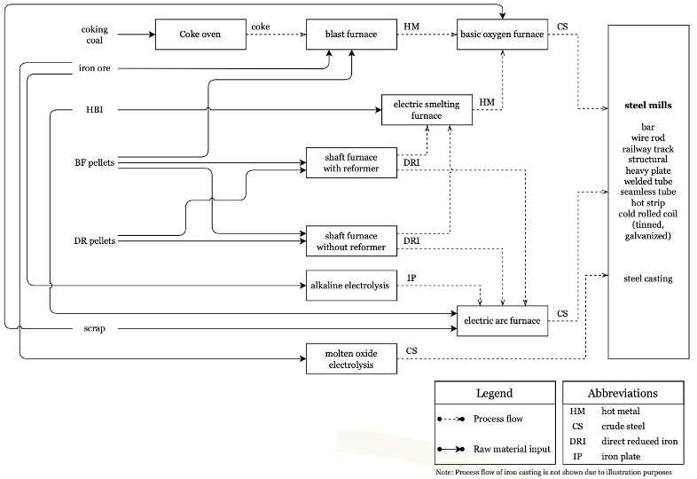
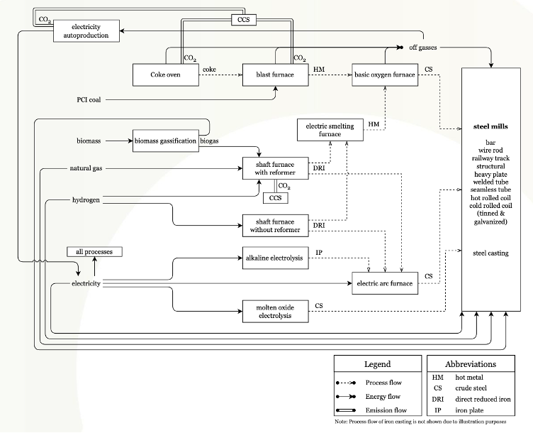
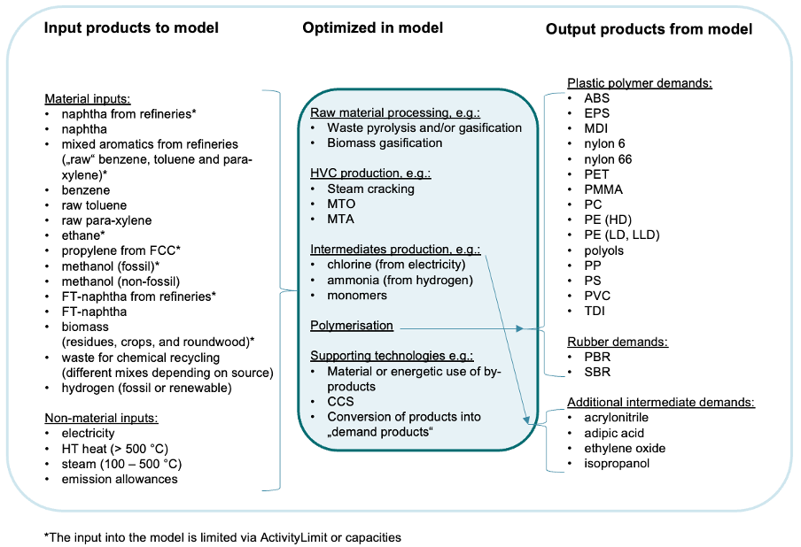
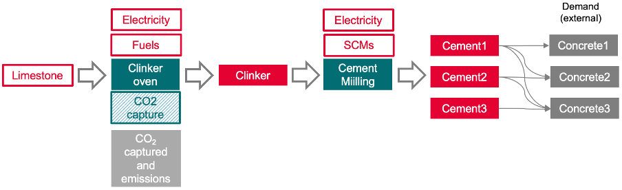

*********************
Sectoral models
*********************

The `ITOM GitHub repo`_ is limited to the modelling framework itself, without the implementation of sectoral models.
Potential users are encouraged to use the framework to implement their own sectoral models, taylored to their research questions.
However, to get a better feeling of what the ITOM framework can do, the following provides pointers to open data sectoral models that have been implemented with ITOM.

.. _ITOM GitHub repo: https://github.com/wupperinst/itom

ITOM-steel
==========

Short description
-----------------

The production chain modelled in ITOM-steel includes technologies for the production of (various forms of) iron from iron ore and iron pellets, 
the production of steel from iron and scrap and the finishing of steel in (a sequence of) rolling mills and by casting processes (see Figure below). 
Geographically, ITOM-steel covers the primary and secondary steel production sites in the EU27+3 (i.e. including the UK, Norway, and Switzerland).

The technical basis features a highly detailed representation of production technologies as well as material, energy, carbon and CO\ :sub:`2` flows, 
including for example energetic use of off-gases in heat furnaces for steel finishing (see Figure below). 
The main driver is an exogenously given production volume of finished steel, differentiated by 13 different products and four quality levels 
(copper tolerance).   

The technologies defined in the model allow it to mix direct reduced iron (DRI), hot briquetted iron (HBI) and scrap in electric arc furnaces (EAFs). 
This enables the flexible operation of EAFs for various steel quality requirements and the analysis of the impacts of such flexibility 
on circularity and recycling in the steel production system.  

In a nutshell, key features of ITOM-steel are:  

* Consideration of copper tolerance of final steel products to endogenously model (limits to) scrap use in steel production 
* Country specific costs for green electricity, hydrogen, as well as natural gas 
* Green iron imports from non-EU countries whose costs are externally defined and on whose use ITOM decides endogenously 
* Endogenous modelling of an intra-EU iron trade 

   Material flows in ITOM-steel

   Schematic overview of energy and carbon flows in ITOM-steel

Data
-----

The input dataset and its documentation for the `steel sectoral model`_ built with ITOM are hosted on Zenodo.

.. _steel sectoral model: https://doi.org/10.5281/zenodo.15772719

.. _itom-petchem:

ITOM-petchem
============

Short description
-----------------

ITOM-petchem covers the value chain of the petrochemical sector, including the production of polymers from a range of raw materials, 
feedstocks and energetic inputs. The driving requirement of the model thus is to produce an exogenously defined amount of 
final products (polymers). Polymers are produced from intermediate products (high-value chemicals or HVC, chlorine, ammonia). 
HVC in turn can be produced from various types of processed feedstocks and secondary materials (see Figure below). 

The technical basis of the model includes various technologies for each of these steps in the production value chain. 
Geographically, ITOM-petchem covers the production sites in the EU27+3 (i.e. including the UK, Norway, and Switzerland), 
itself divided into five regions.   

Note that the ITOM-PetChem does not cover the whole chemicals industry. Parts such as ammonia production for fertilisers, 
chlorine production for sanitation and specialty chemicals are not included. The production of process heat in CHP plants 
and boilers is also not part of the model. The demand for heat is instead expressed as fixed specific demand of processes 
for high-temperature heat (> 500°C) and Steam (100-500 °C) while the energy supply costs that arise from total heat demand 
and externally defined costs for heat supply are considered as part of the cost optimisation. 

In a nutshell, key features of ITOM-petchem are: 

* Spatially explicit representation of existing base chemicals sites and capacities in EU 27+3, as well as transport routes between them (product pipelines, shipping routes)
* Model endogenous optimisation of production networks across sites and steps in the value chain (feedstock, HVC, polymers) 
* Includes chemical recycling technologies and biomass-based production, as well as use of imported synthetic feedstocks 
* Includes modelled regionalised polymer demand and plastic waste for chemical recycling in different sectors over time (mechanical recycling is not part of the optimisation, it is modelled in the MFA module, see D.4.3) 
* Explicit consideration and endogenously optimised usage of by-products of various production processes 

   System boundaries of ITOM-petchem

Data
----

The input dataset and its documentation for the `petrochemical sectoral model`_ built with ITOM are hosted on Zenodo.

.. _petrochemical sectoral model: https://doi.org/10.5281/zenodo.15773103

ITOM-cement
============

Short description
-----------------

The production chain of ITOM-cement includes the production of clinker from limestone and the production of cement from clinker 
and supplementary cementitious materials (SCMs) such as ground blast furnace slag and calcined clays (see Figure below for a schematic overview). 
The model covers the cement demand and the cement clinker kilns in the EU27 and cement mills aggregated on a regional level. 

ITOM-cement features a rich representation of clinker production technologies and of cement types. 
Demand is specified by cement application areas (called “ConcreteX” in the figure below) that may be restricted to certain cement types 
due to requirements with regards to compressive strength, durability and other cement properties. Application areas are currently differentiated 
by a) in-situ concrete for interior components, b) in-situ concrete for exterior components, c) precast concrete, and d) miscellaneous. 

The driving requirement of the model is to satisfy an externally defined amount of cement demand from concrete applications per region 
while externally defined parameters such as energy costs, availability of SCMs and CO\ :sub:`2` prices change over time. 

In a nutshell, key features of ITOM-cement are: 

* Differentiation of cement demand by country and application types with specific requirements  
* Differentiated representation of cements (6 different types of cement)
* Spatially differentiated availability of SCMs and alternative fuels 
* Flexible switch between and blending of fuels (such as coal, waste-based fuels, pet coke and biomass) for clinker production 
* Spatially differentiated representation of transport and storage costs for captured CO\ :sub:`2` 

   
   Schematic overview of the production chain in ITOM-cement

Data
----

The input dataset and its documentation for the `cement sectoral model`_ built with ITOM are hosted on Zenodo.

.. _cement sectoral model: https://doi.org/10.5281/zenodo.15773104