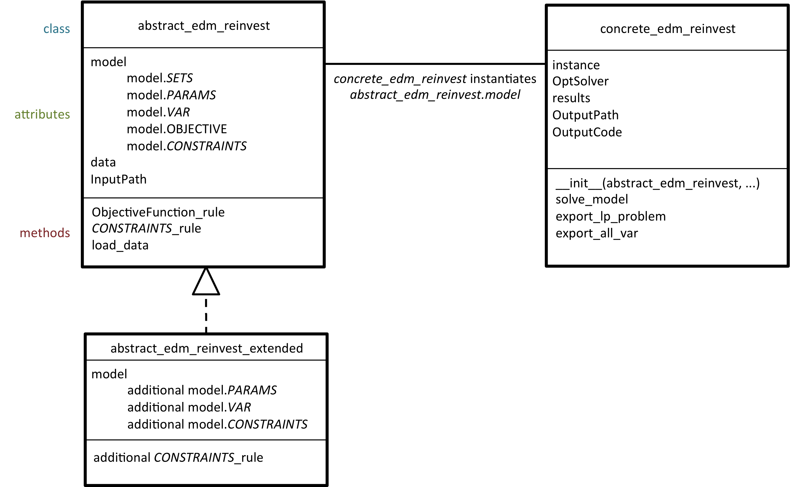

.. highlight:: python

**********
Structure
**********

Framework classes
==================

The following inheritance diagram presents the class components of ITOM as implemented in the *itom.py* file.
Detailed documentation of the classes, their attributes and methods is available below at the conceptual level 
and in the :ref:`components` chapter for the concrete implementation.

The classes *abstract_itom* and *concrete_itom* build up the **core model**.

The class *abstract_edm_reinvest_extended* is not implemented. The graph just shows how the core model could be 
extended (*via* subclassing) with new sets, parameters, variables, constraints, or even objectives.

   
   Class diagram for ITOM

Basics: sets, parameters, constraints, variables
=================================================

Building a sectoral model with  ITOM (see :ref:`sectoral-models`), data is entered into the model through exogenous parameters.
These parameters are indexed with sets (i.e. each parameter is defined for each item in the indexing sets). Equations in the model use
exogenous parameters and define or use endogenous variables, also indexed with sets. Every equation in the model is defined as an 
equality or inequality constraint. See below two examples in pseudo-code to illustrate.

*Example 1*::

   Const. SCA3_TotalAnnualCapacity_1(l,t,y):

         LocalResidualCapacity[l,t,y]
         + LocalAccumulatedNewCapacity[l,t,y]
         = LocalTotalCapacity[l,t,y]

where:

* *SCA3_TotalAnnualCapacity_1(l,t,y)* is an equality constraint defined for each LOCATION,
  TECHNOLOGY, and YEAR.
* *LocalResidualCapacity[l,t,y]* is an exogenous parameter defined for each LOCATION,
  TECHNOLOGY, and YEAR.
* *LocalAccumulatedNewCapacity[l,t,y]* is a variable (generated in another constraint) defined for each
  LOCATION, TECHNOLOGY, and YEAR.
* *LocalTotalCapacity[l,t,y]* is a variable (generated in this constraint) defined for each LOCATION,
  TECHNOLOGY, and YEAR.

In plain English, the constraint means that the installed capacity of any given technology in any year
and location is the sum of the exogenously provided residual capacity and the endogenously invested
new capacity (that has not yet reached its end-of-life).

**Example 2**::

   Const. NCC1_LocalTotalAnnualMaxNewCapacityConstraint(l,t,y):
         
         LocalNewCapacity[l,t,y]
         <= LocalTotalAnnualMaxCapacityInvestment[l,t,y]

where

* *NCC1_LocalTotalAnnualMaxNewCapacityConstraint(l,t,y)* is an inequality constraint defined for each
  LOCATION, TECHNOLOGY, and YEAR.

* *LocalNewCapacity[l,t,y]* is a variable (generated in another constraint) defined for each LOCATION,
  TECHNOLOGY, and YEAR.

* *LocalTotalAnnualMaxCapacityInvestment[l,t,y]* is an exogenous parameter defined for each
  LOCATION, TECHNOLOGY, and YEAR.

In plain English, the constraint means that the endogenously invested new capacity of any
given technology in any year and location cannot exceed exogenously imposed limit for this
technology, location, and year.

Sets
=====

Anything modelled with ITOM is either a PRODUCT (e.g. naphta, ethylene,
polypropylene, iron ore, raw steel, scrap, klinker, cement), a TECHNOLOGY 
(e.g. steamcracker, polymerisation plant, blast furnace, kiln) or a
TRANSPORTMODE (a particular kind of technology, e.g. pipeline, ship).

The set EMISSION represents a particular kind of products. Other sets relate to the temporal (YEAR)
and geographical (REGION, LOCATION) scopes of the model. The last set
MODE_OF_OPERATION applies to items defined under TECHNOLOGY.

List of all sets
-----------------

The following table presents the signification of all input sets defined by the framework 
and required to build a model.

.. csv-table::
   :file: csv/sets.csv
   :widths: 15, 25
   :header-rows: 1

Some sets have special requirements for the model to run properly, which are described below.

TECHNOLOGY
-----------

As mentioned above, technologies are ubiquitous in the model. Two special types of technologies need
to be defined for ITOM-based models to work properly:

1. If you define pipelines (or other point-to-point transport modes) that can run
through several locations (i.e. A => B => C => D etc.) you need to list special
transfer technologies for each product that can be transported via pipeline.
Think of them as pumping stations letting products flow through a location.
You could for example name those pipeline_transfert_PRODUCT but any
other name would do (see :ref:`hacks-pipeline-transfert`).

2. If you use the option “transport hub” in your model you need to list special
transfer technologies for each product that can be transported between any two
locations via the hub. Think of them as dispatch centres routing products
through the transport hub. You could for example name those
transport_hub_PRODUCT but any other name would do.

LOCATION
---------

If you use the option “transport hub” in your model you need to list a location named
TRANSPORT_HUB (name is hardcoded). Any location from any region will be linked to any other
location in any region via this hub.

TRANSPORTMODE
--------------

Two types of transport modes are expected (they are hardcoded in the framework) and should be listed:

1. ONSITE: allows technologies at any location to exchange products between
them within the boundaries of this location (usually at zero or a low cost).

2. OTHER: this is the transport mode that links any location to every other
location, either directly or via a transport hub depending on the modelling
option selected (hub is the config default).

Parameters
===========

Parameters contain the exogenous data to calibrate a model. They are indexed by the sets presented in the previous section.
The following gives a short description and the default value of each exogenous parameter in the framework. Further down, 
we single out a few parameters that have certain specificities.

Lists of all parameters
------------------------

The following tables present the data structure and signification of all input parameters defined by the
framework and expect data when building a model.

The indices provided below have the following signification:
r = REGION, y = YEAR, l = LOCATION, t = TECHNOLOGY, p = PRODUCT, tr =
TRANSPORTMODE, m = MODE_OF_OPERATION, e = EMISSION.

**Economics**

.. csv-table::
   :file: csv/param_eco.csv
   :widths: 20, 20, 5, 10, 30
   :header-rows: 1

**Geography**

.. csv-table::
   :file: csv/param_geo.csv
   :widths: 20, 20, 5, 10, 30
   :header-rows: 1

**Demand**

.. csv-table::
   :file: csv/param_demand.csv
   :widths: 20, 20, 5, 10, 30
   :header-rows: 1

**Performance**

.. csv-table::
   :file: csv/param_perf.csv
   :widths: 20, 20, 5, 10, 30
   :header-rows: 1

**Technology costs**

.. csv-table::
   :file: csv/param_tech_cost.csv
   :widths: 20, 20, 5, 10, 30
   :header-rows: 1
   
**Capacity constraints**

.. csv-table::
   :file: csv/param_cap_cons.csv
   :widths: 20, 20, 5, 10, 30
   :header-rows: 1

**Investment constraints**

.. csv-table::
   :file: csv/param_inv_cons.csv
   :widths: 20, 20, 5, 10, 30
   :header-rows: 1

**Activity constraints**

.. csv-table::
   :file: csv/param_act_cons.csv
   :widths: 20, 20, 5, 10, 30
   :header-rows: 1

ResidualCapacity
-----------------

Technology definitions in this parameter need to be consistent with the definitions implied in the
activity and cost parameters. It is up to the analyst to properly document her choices. Concretely a
technology can usually be defined with respect to input processing capacity (e.g. Mt naphtha a steam
cracker can process in a year) or output production capacity (e.g. Mt ethylene a steam cracker can
produce in a year).

Capacities must be provided for the special technologies *pipeline_transfert_PRODUCT* at the location
where pipelines (or other defined point-to-point transport modes) go through. The capacity should be
equal to the transport capacity of the transport mode. Think of this transfer technology as a pumping
station that can send a product arriving through the pipeline to technologies at the same location that
need it and/or forward it further to the next location down the pipeline (see :ref:`hacks-pipeline-transfert`).

TransportRoute & TransportCapacity
-----------------------------------

The sheets to fill out in the input Excel file do not have the exact same name as the parameters
themselves. The sheets are called *TransportRoute_pipeline* and *TransportCapacity_pipeline*,
respectively. Those names are hardcoded, so do not change them. The reason is that only specific
location to location transport link (e.g. pipelines) should be defined in those sheets.

The following will happen automatically during processing of the input data, before the LP problem is
built:

* Each location receives the capability to transport any product *ONSITE* (that
  is the name of the transport mode) between technologies installed at the
  location.
* [If you use the option “transport hub” in your model.] Each location is
  connected to the transport hub location and the transport hub location is
  connected to each location with the OTHER transport mode (covers road
  and rail transport mainly).
* [If you do NOT use the option “transport hub” in your model.] Each
  location is connected to every other location with the OTHER transport
  mode.

The transport routes defined in the parameters *TransportRoute_pipeline* and
*TransportCapacity_pipeline* are directional. The two REGION columns in the input dataset mean
“region from” and “region to”, respectively in that order. Therefore, bi-directional routes (e.g. a
pipeline between two locations that exchange the same product both ways depending on the availability
of production capacity at both ends of the pipeline) should be defined ***with the same capacity*** both
ways.

Transport routes that use a multi-purpose transport mode must be defined in both parameters for each
product that can be transported with this one transport mode, ***with the same capacity*** for each product
representing the overall capacity of the transport link.

InputActivityRatio & OutputActivityRatio
-----------------------------------------

These two parameters have to be consistent with one another and with how capacity of a given
technology is defined (in general and in particular in parameter *ResidualCapacity*), concretely whether
it is defined with respect to input processing capacity (e.g. Mt naphtha a steam cracker can process in a
year) or output production capacity (e.g. Mt ethylene a steam cracker can produce in a year).

The special technologies *pipeline_transfert_PRODUCT* and *transport_hub_PRODUCT* must be
defined with *InputActivityRatio* = *OutputActivityRatio* = 1.

CapitalCost, VariableCost & FixedCost
--------------------------------------

Technology definitions in these parameters have to be consistent with the capacity and activity
parameters. The cost parameters are defined for each technology at the regional level. These costs can
change over time, e.g. assuming declining costs due to accumulated learning.

.. note::

   | Variable costs are defined at the regional level, to keep data input simpler
   | and save some mode equations. However, variable costs defined at the local level 
   | would allow for a higher granularity of production costs. A typical example is different 
   | process energy costs (e.g. as electricity, heat, hydrogen) for different locations within the same region. 
   | See :ref:`hacks-energy-centers` for more information on how to deal with such a case.

The special technologies *pipeline_transfert_PRODUCT* must be defined with very high capital cost so
that they are not installed in locations where they were not explicitly placed as *ResidualCapacity*.
The special technologies *transport_hub_PRODUCT* must not be defined, they will receive *CapitalCost*
= 0 by default and be installed in transport hubs only.

TimeStep
---------

An item in the set YEAR can be understood as a label for a time period of length TimeStep. For mainly
practical reasons (server memory and processing capacities) we do not run the model with a yearly
resolution but for time periods of length 10 (we hope to be able to reduce this length to 5). Note that
10 | Wuppertal InstituteEDM-invest
TimeStep is required for each “year” (i.e. each item in set YEAR) but the same value is expected for
each.

MatchTechnologyRetrofit
------------------------

The two TECHNOLOGY columns in the input dataset mean “technology that can be retrofitted” and
“retrofit technology”, respectively in that order. A retrofit technology can also be a technology that can
be retrofitted (again). In such a case, the same technology name appears in both columns.

Constraints
============

The complete list of constraints (i.e. equations in the framework) is available in the :ref:`components` chapter.

Core constraints of the model define product flows in the system. There are two categories of 
flows: production and use of products by technologies.

Production
-----------

The production (or output) of a product from a technology at a given location in a given mode of
operation is equal to the (rate of) activity of this technology multiplied with a product **output** to
production activity ratio entered by the analyst (parameter *OutputActivityRatio*)::
    
    Production = Activity * OutputActivityRatio

Use
----

The use (or input) of a product by a technology at a given location in a given mode of operation is equal
to the (rate of) activity multiplied with a product **input** to production activity ratio entered by the
analyst (parameter *InputActivityRatio*)::
    
    Use = Activity * InputActivityRatio

Both constraint categories above require the definition of core constraints pertaining to the *activity* of technologies.

Activity
---------

The activity of a given technology at a given location is decided by the solver in order to generate
production to meet demand::
    
    Activity <= Capacity * AvailabilityFactor * CapacityToActivityUnit

There are several additional constraints that can be put on the activity level (minimum and
maximum activity). These are defined at the regional level (i.e. they regard the sum of
activities in the locations of a region) and can apply either annually (parameters
*TotalTechnologyAnnualActivityUpperLimit* and
*TotalTechnologyAnnualActivityLowerLimit*) or over the whole modelling period (parameters
*TotalTechnologyModelPeriodActivityUpperLimit* and
*TotalTechnologyModelPeriodActivityLowerLimit*).

The next core constraint category builds on the above, ensures that demand is met, and product flows balanced.

Product balance
----------------

For each year and region, the total production of each product + imports of this product from locations
outside the region should be larger than or equal to this product’s demand in the considered region. If
production + imports is larger than demand, this can mean that this region is a net exporter (via
transport to locations outside the region)::

    Production + Import - Export >= Demand

.. note::

   | The *Demand* parameter passed to the model represents the final net demand for a
   | product (in our case an end-product such as a polymer), i.e. it does not account for potential
   | intermediary product use in the industry.
   | As consequence the shadow prices from this constraint give no insight into the marginal production
   | costs of intermediates. It is, however, possible to work around this limitation and access this information (see :ref:`hacks-shadow-prices`). 

All the above constraints rely at some level on the constraints dealing with capacity presented below.

New capacity
-------------

For each technology, constraints on minimum and maximum investments per time step are defined
locally. This allows to reflect business and political decisions known today that will affect investments
in the future, or simply to simulate the impact of potential such decisions. The corresponding
parameters are *LocalTotalAnnualMaxCapacityInvestment* and
*LocalTotalAnnualMinCapacityInvestment*.

Installed capacity
-------------------

For each year the available installed capacity is equal to the sum of the exogenously given
residual capacity, the accumulated new capacity decided by the solver for the previous time
steps (that has not reached its end-of-life yet) and the retrofitted capacities::

    Installed capacity = Residual capacity
                         + SUM past New capacity
                         + Retrofits

Both upper and lower limits can be set for the total installed capacity at the regional level. This may be
used to reflect political targets set e.g. by countries . The corresponding parameters are
*TotalAnnualMaxCapacity* and *TotalAnnualMinCapacity*.

The framework can include or exclude retrofitting (default is include) of production capacities 
reaching their technical end-of-life. Retrofitting rules obey to their own set of
constraints.

Retrofitting
-------------

The parameter *MatchTechnologyRetrofit* defines which technologies can be retrofitted with which
retrofit technologies. The model checks at each time step (except in the first one, where retrofitting
cannot happen) which capacity of “technologies that can be retrofitted” reached end-of-life and might
therefore indeed be retrofitted. There are two cases:

1. The exogenously provided residual capacity of a technology “that can be
   retrofitted” decreases between two time steps: this delta capacity is a 
   potential for retrofit.
2. The endogenously installed new capacity of a technology “that can be
   retrofitted” reaches its end-of-life: this capacity is a potential for retrofit.

Investment in new retrofit technology capacity is then constrained as maximum 110% of the potential
for retrofit (the 1.1 factor is hardcoded)::

    SUM Retrofits <= 1.1 * Capacity reaching EOL

Another core feature of the framework is the capability to exchange products between locations, as defined 
in the constraints presented next.

Transport
----------

Exchange capabilities are defined with directional transport links (parameter *TransportRoute*) between
locations (regardless of the regions these locations belong to). Between two locations there can exist no
transport link or one or more links, each using a different mode of transport (defined in the Set
TRANSPORTMODE). For each transport link between two locations, a maximum yearly carrying
capacity is provided (parameter *TransportCapacity*).

Transport flows must then comply with a number of constraints.

Transport capacity
-------------------

For each product, each transport mode, each year, transport from location L1 to location L2 is either
smaller or equal to the transport link capacity if a transport route exists, or 0 if there is no route. If the
route is bi-directional the sum of transport from L1 to L2 and L2 to L1 is smaller or equal to the
transport link capacity in one direction (capacity of both directions should be equal). If the transport
mode is multi-purpose (i.e. can transport different products in separate batches) the sum of the
quantities transported for all products is smaller or equal to the transport capacity::

    SUM_products ( Transport L1 to L2 + Transport L2 to L1 ) <= Transport capacity

Outgoing & Incoming transport
------------------------------

At each location L the total quantity of each product transported to all other locations each year is
smaller or equal to the production of this product at location L. This deals with locations at the end
of the value chain (that generate end-products that are neither used by any technology nor need to be
transported, when assuming that locations produce for their own regional demand). It also covers
locations with multi-output technologies that have to run to produce a minor by-product thus generating
a surplus of a major output::
    
    SUM_locations Transport[product] L0 to L <= Production[product] in L0

At each location L the total quantity of each product transported (arriving) from all other locations each
year is equal to the use of this product at location L::
    SUM_locations Transport[product] L to L0 = Use[product] in L0

Import & Export
----------------

Import and export refer to product flows between regions while transport refers to product
flows between locations. Imports to a region R are the sum of the transport flows from
locations outside that region R to locations in that region R. Exports from a region R are the
sum of the transport flows from locations in that region R to locations outside that region R.

Transport Hubs
---------------

Hubs are a special kind of location that must be listed in the Set *Hublocation*. Only a special kind of
technology (that must be listed in the Set *HubTechnology*) can be installed at a transport hub. Think of
those technologies as switch stands that redirect transport flows from one location to another through
the hub. No product is consumed in a hub, all product flows arriving at the hub are forwarded by the
hub technologies (therefore use = production) and exit the hub::

    SUM_locations Transport[product] L to Hub
        = Use[product] in Hub
        = Production[product] in Hub
        = SUM_locations Transport[product] Hub to L

Last but not least the constraints related to costs presented below make up their own category of core constraints.

Investment Costs, Operational Costs & Emission Costs
-----------------------------------------------------

Investment costs are accounted for in full on the year new capacity is commissioned. Operational costs
consist of yearly variable costs depending on activity levels and yearly fixed costs depending on
installed capacity. Emission related costs depend on activity levels, emission intensities and emission
penalties (e.g. CO\ :sub:`2` prices)::
    
        Investment cost = New capacity * CapitalCost
        Operational cost = Activity * VariableCost + Capacity * FixedCost
        Emission cost = Activity * EmissionActivityRatio * EmissionPenalty
    
Transport Costs
----------------

Transport cost intensities for each mode of transport (parameter
*TransportCostByMode*) are defined regionally (and can vary over time, e.g. if
assuming that shipping costs will increase). Actual transport costs, however, are first
calculated at the local level (as model variables). For each location, transport costs for
a given product are the costs of transporting this product FROM other locations to
that location (as the sum of the quantities transported per mode of transport multiplied
by the specific costs of each mode of transport). In other words, the importer is the
buyer and pays the transport costs.

When aggregated at the regional level, transport costs include both intra-regional transport *and*
imports from other regions. There is no double-counting, however, since transport costs are only
registered at the importing location.

Salvage Value
--------------

Howells et al. (2011)\ [#f1]_ describe the implementation of salvage value in OSeMOSYSas follows:
    
    “When a technology is invested in during the model period but ends its operational life before, it is
    assumed to have no value at the end of the model period. However, if a technology (invested in during
    the model period) still has some component of its operational life at the end of the period, that should
    be estimated. Several methods exist to determine the extent to which a technology has depreciated. And
    this in turn is used to calculate its salvage value by the end of the period. [...] A salvage value is 
    determined, based on the technology’s operational life, its year of investment and discount rate. 
    Following this it is discounted to the beginning first model year by a discount rate applied over the modelling period.”

The type of depreciation used to calculate the salvage value is determined in the parameter *DepreciationMethod*:

* 1: Sinking fund depreciation (default)
* 2: Straight line depreciation

Discounted costs
-----------------

Each cost item [capital, fixed, variable, transport, salvage value, emission penalties] should be
calculated in constant monetary terms and then discounted to determine a net present value (NPV).
Since in our model we calculate costs first at the local level and then aggregate at the regional level, we
try to discount costs early, i.e. already at the local level, so as to allow comparisons of different cost
categories across both locations and time.

Variable names give indications on the level processing of different cost items, for example:

* *LocalCapitalInvestment*: local, undiscounted
* *LocalDiscountedCapitalInvestment*: local, discounted
* *DiscountedCapitalInvestment*: regional, discounted

.. rubric:: Footnotes

.. [#f1] Howells, M., Rogner, H., Strachan, N., Heaps, C., Huntington, H., Kypreos, S., Hughes, A., Silveira, S., DeCarolis, J., Bazillian, M., Roehrl, A. (2011) OSeMOSYS: The Open Source Energy Modeling System - An introduction to its ethos, structure and development. *Energy Policy*, 39 (2011), 5850–5870.